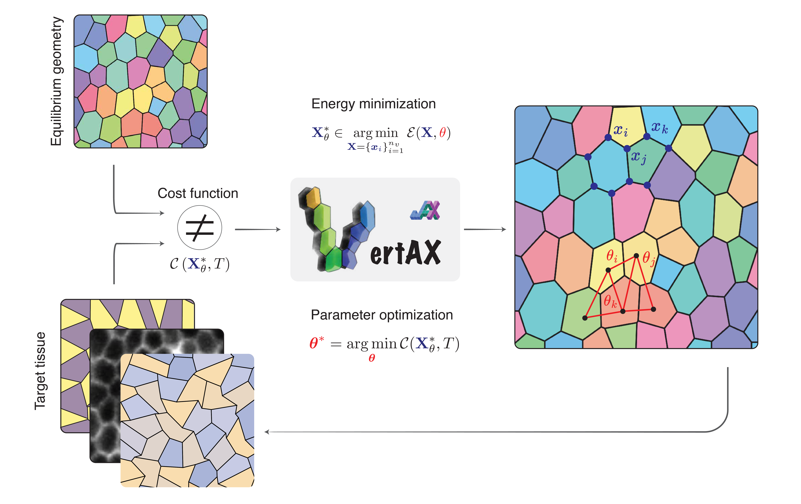

<div align="left">

<!-- Badges -->
[](https://creativecommons.org/licenses/by-sa/4.0/)
[](https://pypi.org/project/vertAX)

<!-- [](https://zenodo.org/badge/latestdoi/144513571) -->

</div>

<table border="0" cellspacing="0" cellpadding="0">
<tr>
<td width="40%" border="0">


</td>
<td width="60%" border="0">
<b>
A differentiable JAX-based framework<br>
for vertex modeling and inverse design of epithelial tissues.
</b>
<br><br>

[](https://gitlab.college-de-france.fr/virtualembryo/vertax) <br><b>— all in one unified Python package.</b>

</td>
</tr>
</table>

---

## What is VertAX?

Epithelial tissues dynamically reshape through local mechanical interactions among cells. Understanding, inferring, and designing these mechanics is a central challenge in developmental biology and biophysics. **VertAX** is a computational framework built to address this challenge.

**VertAX** is a **framework for vertex-based modeling**: it represents epithelial tissues as two-dimensional polygonal meshes in which cells are faces, junctions are edges, tricellular contacts are vertices, and mechanical equilibrium is defined by the minimum of a user-specified energy. Built on **JAX**, VertAX is designed not only for forward simulation, but also for inverse problems such as parameter inference and tissue design.

---

## Conceptual Overview

VertAX treats inverse modeling as a **bilevel optimization** problem:

$$
\begin{aligned}
\textbf{Outer problem (learning):} \quad
\theta^{\ast} &= \arg\min_{\theta} \mathcal{C}\left(X^{\ast}_{\theta},\theta\right)
&& \leftarrow \text{fit data or reach a target} \\
\textbf{Inner problem (physics):} \quad \text{s.t.}&\;\;
X^{\ast}_{\theta} \in \arg\min_{X} \mathcal{E}(X,\theta)
&& \leftarrow \text{compute mechanical equilibrium}
\end{aligned}
$$

Here, $X$ denotes the tissue configuration, i.e. the vertex positions of the mesh, and $\theta$ denotes the model parameters, such as line tensions, target areas, or shape factors.

In other words, VertAX repeatedly solves a mechanical equilibrium problem for a given parameter set $\theta$, then updates those parameters to better match data or a design objective.

<p align="center">
  <br>
  <em>Figure: Bilevel optimization loop in VertAX.</em>
</p>

---

## Core Features

- 🧩 **Bilevel optimization framework**  
  VertAX formulates inverse problems as nested optimization: an inner mechanical equilibrium problem and an outer parameter-learning problem.

- 🔬 **Multiple gradient strategies**  
  Supports **Automatic Differentiation (AD)**, **Implicit Differentiation (ID)**, and **Equilibrium Propagation (EP)**.

- 🔁 **Differentiable and non-differentiable workflows**  
  VertAX supports fully differentiable pipelines, while EP also enables inverse modeling with simulators that are only accessible through repeated executions.

- ⚡ **GPU acceleration with JAX**  
  JIT compilation and vectorization enable efficient simulations on CPU and GPU.

- 🎨 **Custom energies and costs in plain Python**  
  Define your own mechanical models and inverse-design objectives without changing the library internals.

- 🏗️ **Two simulation modes**  
  Supports both periodic tissues (bulk mechanics) and bounded tissues (finite clusters with curved interfaces).

- 🔀 **Automatic topology changes**  
  Handles T1 neighbor exchanges during optimization.

- 🔗 **Seamless ML integration**  
  Designed to work naturally with the JAX/Optax ecosystem.


---

## Installation

We recommend installing VertAX in a virtual environment:

```sh
python -m venv .venv
source .venv/bin/activate
```

### From source
```
git clone https://github.com/VirtualEmbryo/VertAX.git
cd vertax
pip install -e .
```
### From PyPI
```
Coming soon.
```


**Dependencies**: JAX, Optax, SciPy (for Voronoi initialization), Matplotlib (for plotting).

For GPU support, install JAX with CUDA as described in the [JAX docs](https://github.com/google/jax#installation) before installing VertAX.

---

## Simulation modes

VertAX supports two complementary simulation modes, designed for different classes of epithelial mechanics problems. The **periodic** mode is best suited for bulk tissue dynamics without explicit external boundaries, while the **bounded** mode is designed for finite tissue clusters with curved free interfaces. Both modes share the same vertex-based formulation and optimization framework, but differ in how boundaries are represented and initialized.


<table>
  <tr>
    <th>Mode</th>
    <th>Use case</th>
    <th>Initialization</th>
    <th>Illustration</th>
  </tr>
  <tr>
    <td><b>Periodic</b></td>
    <td>Bulk tissue dynamics, no explicit boundaries</td>
    <td>Random Voronoi seeds or segmented images (Cellpose)</td>
    <td rowspan="2" align="center">
      
    </td>
  </tr>
  <tr>
    <td><b>Bounded</b></td>
    <td>Finite tissue clusters with curved interfaces</td>
    <td>Random Voronoi seeds; boundary arcs as additional degrees of freedom (DOFs)</td>
  </tr>
</table>

---

## Quick Start — Forward Modeling

The simplest usage is to create a periodic tissue mesh, define an energy, and minimize it.

```python
import jax.numpy as jnp

from vertax import PbcBilevelOptimizer, PbcMesh, plot_mesh
from vertax.energy import energy_shape_factor_homo

# --- Mesh setup ---
n_cells = 100
L_box = jnp.sqrt(n_cells)

mesh = PbcMesh.periodic_voronoi_from_random_seeds(
    nb_seeds=n_cells,
    width=float(L_box),
    height=float(L_box),
    random_key=1,
)

# --- Attach parameters ---
mesh.vertices_params = jnp.asarray([0.0])
mesh.edges_params    = jnp.asarray([0.0])
mesh.faces_params    = jnp.asarray([3.7])   # uniform target shape factor

# --- Define energy ---
def energy(vertTable, heTable, faceTable, _vert_params, _he_params, face_params):
    return energy_shape_factor_homo(
        vertTable,
        heTable,
        faceTable,
        float(L_box),
        float(L_box),
        face_params,
    )

# --- Minimize and visualize ---
optimizer = PbcBilevelOptimizer()
optimizer.loss_function_inner = energy
optimizer.inner_optimization(mesh)

mesh.save_mesh("equilibrium.npz")
plot_mesh(mesh)
```

---

## Quick Start — Inverse Modeling

VertAX can also optimize model parameters to match a target geometry.

```python
import math
import jax
import jax.numpy as jnp
import optax

from vertax import PbcBilevelOptimizer, PbcMesh, BilevelOptimizationMethod, plot_mesh
from vertax.cost import cost_v2v
from vertax.energy import energy_shape_factor_hetero

# --- Mesh setup ---
n_cells = 20
width = height = math.sqrt(n_cells)

mesh = PbcMesh.periodic_voronoi_from_random_seeds(
    nb_seeds=n_cells, width=width, height=height, random_key=0
)

# --- Attach parameters ---
mesh.vertices_params = jnp.zeros(mesh.nb_vertices)
mesh.edges_params    = jnp.zeros(mesh.nb_half_edges)   # not used here
mesh.faces_params    = jnp.full(mesh.nb_faces, 3.7)    # initial target shape factors

selected_faces = jnp.arange(mesh.nb_faces)

# --- Built-in energy function ---
def energy(vertTable, heTable, faceTable, _vert_params, _he_params, face_params):
    return energy_shape_factor_hetero(
        vertTable, heTable, faceTable,
        width, height,
        selected_faces,
        face_params,
    )

# --- Optimizer setup ---
optimizer = PbcBilevelOptimizer()
optimizer.loss_function_inner = energy
optimizer.inner_solver = optax.sgd(learning_rate=0.01)
optimizer.update_T1 = True
optimizer.min_dist_T1 = 0.005

# --- Relax the initial mesh ---
optimizer.inner_optimization(mesh)

# --- Create a target mesh with different face parameters ---
target = PbcMesh.copy_mesh(mesh)

key = jax.random.PRNGKey(1)
target.faces_params = 3.7 + 0.2 * jax.random.normal(key, shape=(target.nb_faces,))
target.vertices_params = jnp.zeros(target.nb_vertices)
target.edges_params    = jnp.zeros(target.nb_half_edges)

optimizer.inner_optimization(target)

# --- Register the target ---
optimizer.vertices_target = target.vertices.copy()
optimizer.edges_target    = target.edges.copy()
optimizer.faces_target    = target.faces.copy()

# --- Outer loss and bilevel method ---
optimizer.loss_function_outer = cost_v2v
optimizer.outer_solver = optax.adam(learning_rate=1e-4, nesterov=True)
optimizer.bilevel_optimization_method = BilevelOptimizationMethod.EQUILIBRIUM_PROPAGATION

# --- Run bilevel optimization ---
for epoch in range(20):
    optimizer.bilevel_optimization(mesh)

plot_mesh(mesh, title="Recovered mesh after inverse modeling")
```

For full inverse-modeling examples, see [Tutorials](#tutorials) section..

---

## Tutorials

See the [`docs/`](docs) folder for in-depth examples:

| Notebook | Description |
|---|---|
| `inverse_modelling_example.ipynb` | Inverse modeling with periodic boundary conditions |
| `inverse_modelling_example_bounded.ipynb` | Inverse design with bounded cluster (convergent extension) |

---

## Gradient Strategies

VertAX implements and benchmarks three complementary methods for computing outer gradients through the implicit inner problem:

| Method | How it works | Pros | Cons |
|---|---|---|---|
| **AD** (Automatic Diff.) | Unrolls the inner optimization steps; forward-mode JVP via `jax.jacfwd` | Exact for differentiable pipelines; easy in JAX | Cost scales with # iterations × # parameters |
| **ID** (Implicit Diff.) | Differentiates the optimality condition ∇ₓE=0 via Implicit Function Theorem; JVP or adjoint (VJP) variant | No unrolling; constant memory; exact near equilibrium | Requires Hessian solve; sensitive to ill-conditioning |
| **EP** (Equilibrium Prop.) | Estimates gradient from perturbed free and nudged equilibria; no backprop required | Memory-efficient; works with non-differentiable/incomplete solvers | Approximate; depends on perturbation size β |

**In practice**: AD and EP often recover similar parameter trends on synthetic inverse problems, while EP is especially attractive for simulators that cannot be made fully differentiable.

Selecting the method:

```python
from vertax import BilevelOptimizationMethod

# Automatic differentiation (default)
optimizer.bilevel_optimization_method = BilevelOptimizationMethod.AD

# Implicit differentiation — adjoint-state (VJP) mode
optimizer.bilevel_optimization_method = BilevelOptimizationMethod.ADJOINT_STATE

# Implicit differentiation — sensitivity (JVP) mode
optimizer.bilevel_optimization_method = BilevelOptimizationMethod.SENSITIVITY

# Equilibrium propagation
optimizer.bilevel_optimization_method = BilevelOptimizationMethod.EQUILIBRIUM_PROPAGATION
```

---

## Advanced concepts

### 📐 Half-edge data structure

Mesh topology in VertAX is encoded through three core tables — `vertTable`, `heTable`, and `faceTable` — which separate geometry from connectivity and enable fast, JIT-friendly computations. In bounded mode, an additional `angTable` stores the curvature of boundary arcs.

```text
vertTable  [n_v  × 2] :  (x, y) coordinates of vertices

heTable    [n_he × 8] :  prev | next | twin | source | target | face | offset_x | offset_y

faceTable  [n_f  × 1] :  index of one half-edge belonging to each face

angTable   [n_be × 1] :  arc angle for each boundary edge  (bounded mode only)
```

Each edge is represented by two oppositely oriented half-edges, which makes local topology updates straightforward and allows oriented edge-based quantities to be handled naturally. In periodic mode, half-edges crossing the simulation box carry offset flags `(-1, 0, +1)` that specify the periodic image of their target vertex and ensure topological continuity across boundaries.

### 🔀 T1 topological transitions

VertAX handles **T1 neighbor exchanges** automatically: when an edge shortens below a prescribed threshold, two candidate updates are considered: either the edge is stretched along its current direction, or it is replaced by a new edge perpendicular to it (a T1 transition). The configuration with lower energy is then accepted.

--- 

## API Reference

### Mesh classes

| Class | Description |
|---|---|
| `PbcMesh` | Periodic boundary conditions mesh |
| `BoundedMesh` | Finite cluster with curved boundary arcs |
| `PbcMesh.periodic_voronoi_from_random_seeds(nb_seeds, width, height, random_key)` | Create periodic mesh from random Voronoi seeds |
| `BoundedMesh.from_random_seeds(nb_seeds, width, height, random_key)` | Create bounded mesh from random seeds |
| `PbcMesh.copy_mesh(mesh)` | Deep copy of a mesh |
| `mesh.save_mesh(path)` | Save mesh to `.npz` |
| `PbcMesh.load_mesh(path)` | Load mesh from `.npz` |

### Optimizer classes

| Class | Description |
|---|---|
| `PbcBilevelOptimizer` | Optimizer for periodic meshes |
| `BoundedBilevelOptimizer` | Optimizer for bounded meshes |
| `.inner_optimization(mesh)` | Run energy minimization (inner problem) |
| `.bilevel_optimization(mesh)` | Run one epoch of bilevel optimization (outer problem) |

### Key optimizer attributes

| Attribute | Default | Description |
|---|---|---|
| `loss_function_inner` | — | Energy function `E(vertTable, heTable, faceTable, vert_params, he_params, face_params)` |
| `loss_function_outer` | — | Cost function `C(vertices, edges, faces, ...)` |
| `inner_solver` | `optax.sgd(lr=0.01)` | Optax optimizer for inner problem |
| `outer_solver` | `optax.adam(lr=1e-4, nesterov=True)` | Optax optimizer for outer problem |
| `bilevel_optimization_method` | `EQUILIBRIUM_PROPAGATION` | Gradient strategy |
| `update_T1` | `True` | Enable T1 topological transitions |
| `min_dist_T1` | `0.005` | Edge length threshold for T1 |
| `max_nb_iterations` | `1000` | Max inner optimization steps |
| `tolerance` | `1e-4` | Loss stagnation threshold |
| `patience` | `5` | Steps before early stopping |

### Geometry utilities (`vertax.geo`)

| Function | Description |
|---|---|
| `get_area(face, vertTable, heTable, faceTable, width, height, max_iter)` | Cell area (periodic) |
| `get_length(he, vertTable, heTable, faceTable, width, height)` | Half-edge length (periodic) |
| `get_area_bounded(face, vertTable, angTable, heTable, faceTable)` | Cell area (bounded) |
| `get_edge_length(edge, vertTable, heTable)` | Inner edge length (bounded) |
| `get_surface_length(edge, vertTable, angTable, heTable)` | Boundary arc length (bounded) |

### Built-in energy functions (`vertax.energy`)

| Energy | Formula | Parameters | Use case |
|---|---|---|---|
| **E₁** — Shape factor | `Σ_α (a_α − 1)² + Σ_α (p_α − p⁰_α)²` | Per-cell target shape factor `p⁰_α`; `a_α = A_α/A₀`, `p_α = P_α/√A₀` | Cell-scale heterogeneity, rigidity transitions |
| **E₂** — Line tension | `½K Σ_α (A_α − A⁰_α)² + Σ_{ij} γ_{ij} ℓ_{ij}` | Elastic modulus `K`, per-cell target area `A⁰_α`, per-edge tension `γ_{ij}` | Force inference, convergent extension |

Both energies can be mixed, extended, or replaced entirely with your own Python function.

### Built-in cost functions (`vertax.cost`)

| Function | Description |
|---|---|
| `cost_v2v` | Vertex-to-vertex MSE |
| `cost_mesh2image` | Mesh-to-image MSE
| `cost_ratio` | Aspect ratio cost `(a₁/a₂ − 2)²` |

Cost functions can be mixed, extended, or replaced entirely with your own Python function.

### Plotting (`vertax`)

```python
from vertax import plot_mesh, EdgePlot, FacePlot, VertexPlot

plot_mesh(
    mesh,
    edge_plot=EdgePlot.EDGE_PARAMETER,    # or INVISIBLE, DEFAULT
    face_plot=FacePlot.FACE_PARAMETER,    # or INVISIBLE, DEFAULT
    vertex_plot=VertexPlot.INVISIBLE,     # or DEFAULT
    edge_parameters_name="tension",
    face_parameters_name="area",
    title="My mesh"
)
```
--- 

## Citing VertAX

If you use VertAX in your research, please cite:

> Pasqui A., Catacora Ocana J.M., Sinha A., Perez M., Delbary F., Gosti G., Miotto M., Caudo D., Ruocco G., Ernoult M.\*, Turlier H.\* (2025). *VertAX: A Differentiable Vertex Model for Learning Epithelial Tissue Mechanics.*

If a DOI or preprint becomes available, we also recommend citing that version.

---

## Funding

This project received funding from the European Union’s Horizon 2020 research and innovation programme under the **European Research Council** (ERC) grant agreement no. **949267**, and under the **Marie Skłodowska-Curie** grant agreement no. **945304** — Cofund **AI4theSciences**, hosted by **PSL University**. AP, JMCO, AS, FB, MP, FD and HT acknowledge support from CNRS and Collège de France

---

## License

VertAX is distributed under the **Creative Commons Attribution–ShareAlike 4.0 International (CC BY-SA 4.0)** [`license`](LICENSE).

You are free to share and adapt the material, provided that appropriate credit is given and that any derivative work is distributed under the same license.